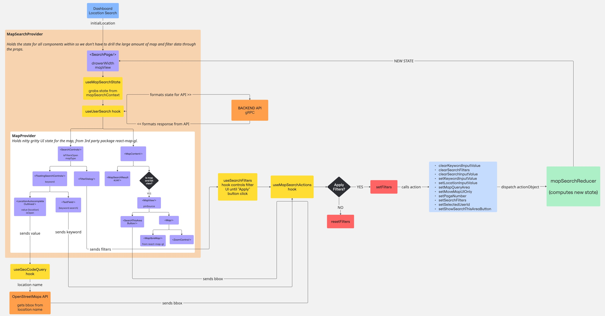

# Map Search Architecture

Our map search is the core way our users find each other for meetups and to find hosts. Map search was recently re-architected by Nicole ([@nabramow](https://github.com/nabramow)) in order to solve issues with scalability and address long-standing user feature requests and bugs.

This page serves as a guide to the map architecture and covers the major logic. If you just picked up your first map ticket on the front-end, this is a good place to start!

* [Important terms](#important-terms)
* [Frontend Map Search Architecture Diagram](#frontend-map-search-architecture-diagram)
* [Major concepts](#major-concepts)
    - [Separate UI-only state from API-shaped state](#separate-ui-only-state-from-api-shaped-state)
    - [Storing map state in useReducer](#storing-map-state-in-usereducer)
    - [Wrapping the map in useContext](#wrapping-the-map-in-usecontext)
* [Common Developer Flows](#common-developer-flows)
    - [How to Add a New Filter](#how-to-add-a-new-filter)


## Important terms

- **bbox (bounding box)** is a rectangular area defined by geographic coordinates—usually [west, south, east, north]—used to represent the visible region on a map or to limit a spatial query.
- **filters** a set of defined criteria that limit the number of users visible in the map, e.g. "accepts last minute requests", "age", "allows smoking".
- **useGeoCodeQuery** a custom hook that takes in a location name, calls the 3rd party, open-source OpenStreetMaps API, and returns a bbox value we can use to move the map to a defined location.

## Frontend Map Search Architecture Diagram

Here's a visual representation of the frontend map search architecture.



## Major Concepts

Let's break down the major concepts of this architecture.

- [Separate UI-only state from API response state](#separate-ui-only-state-from-api-response-state)
- [useReducer - manages complex state logic by using a reducer function to handle state transitions based on dispatched actions, similar to how Redux works.](#storing-map-state-in-usereducer)
- [useContext - allows you to access and share values between components without having to pass props manually deep through the component tree](#wrapping-the-map-in-usecontext)

### Separate UI-only state from API-shaped state

Mostly we use [react-query](https://tanstack.com/query/latest) (a.k.a. Tanstack Query) for state management, which stores api responses as is in the browser cache. This generally works for us, as we mostly use the api response close to the format its returned in for the UI.

For the map, however,we need to modify the API response format significantly before using it in the UI. In some cases, we want to change the UI without calling the api again (e.g. dragging while zoomed out, dragging while a filter is selected).
Decoupling UI-state from api query response allows us to store UI-specific state.

Turns out, maps have a lot of state! In short, we don't want to call the API every time we move the map, hence why clearly separting logic was key to the refactoring.

### Storing map state in useReducer

Since we mostly use react-query to handle our frontend app state, which stores data in the same form as the API response, we didn't already have a pattern for handling state that's significantly different from the API or is for UI-only (e.g. zoom level).

We use `useState`, but that is a bit too small for the job here.

`useReducer` is a concept that came from Redux, and it's handy for managing more complex state logic where multiple values are related, or updates depend on the previous state. It also makes it easier to track how state changes over time through clearly defined action types. In the case of our map, we needed to track and update things like bbox, zoom, keyword, filters, pageNumber and uiOnly map values in one centralized place, and useReducer gave us that structure.

`useReducer` holds all the business logic of a piece of your state, and also allows you to compute state values based on multiple other values. For example, we've computed values like `hasActiveFilters` by looking at every filter and whether they are all undefined, which is then used by the UI to conditionally adjust based on whether there are filters are not. This is a lot cleaner than checking all 10+ filters in the component.

We update the state by dispatching actions—plain objects that describe the change we want to make. This allows us to keep all state transitions predictable and centralized in the reducer function, making debugging and testing much easier.

### Wrapping the map in useContext

As we already mentioned, there is a LOT of map state. Previously we were passing everything through the props, often 15+ props at a time, in a practice called prop drilling. This was making it harder to see what each individual component was doing and making the code less readable.

When many different components need to access the same values from the state, useContext can be a good option. React’s Context API allows you to define a Provider at a higher level in your component tree, and any child component can consume the values without needing them passed down through every intermediate layer. This is especially helpful for shared state like our map UI.

In our case, we have one hook to access the state values: `useMapSearchState`. It can be imported anywhere in the component tree to grab the current values from the centralized map state context. For example:

```typescript
const {
  hasActiveFilters,
  search: { bbox, query },
  shouldSearchByUserId,
} = useMapSearchState();

// do something with state values (e.g. make filter icon selected, rerender map location, etc.)
```

This pattern keeps our components clean and focused, while still giving them access to the full power of the state.

## Common Developer Flows

Here's some common scenarios you might need to address with the map.

### How to Add a New Filter

- [] Add the filter to the `FilterDialog` component so it appears in the UI
- [] Add the filter key to the `initialState` in mapSearchReducer.ts.
- [] Add logic for filter key to `SET_FILTERS` logic in mapSearchReducer.ts
- [] Add the value in the API format matching backend protos to `UserSearchFilters` type
- [] Add the value in state-matching format to `FilterOptions` type
- [] Update the `hasActiveFilters` logic if needed.
- [] Pass the new filter to the backend via the `userSearch` api call in app/web/service/search.ts
